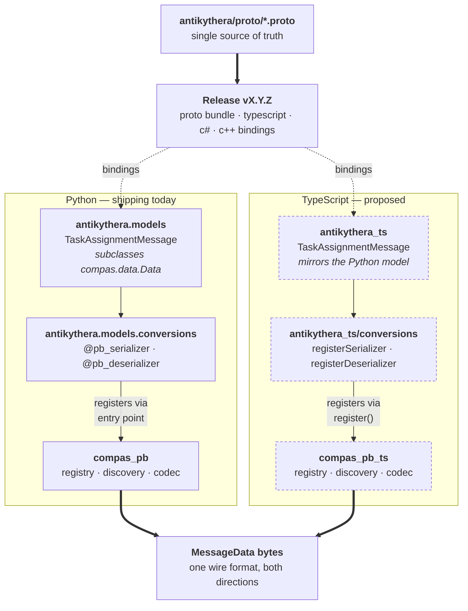
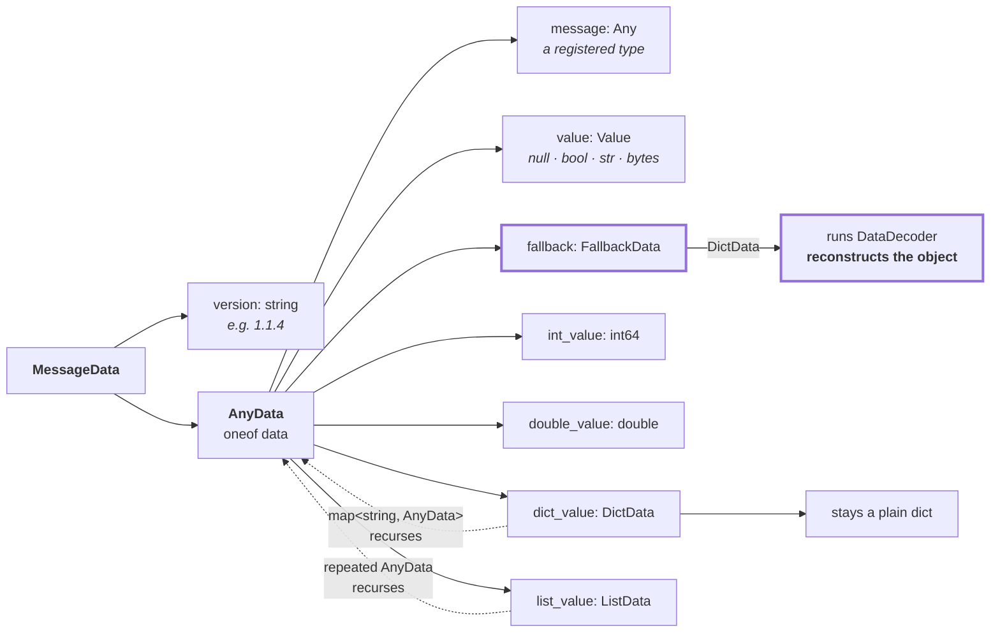
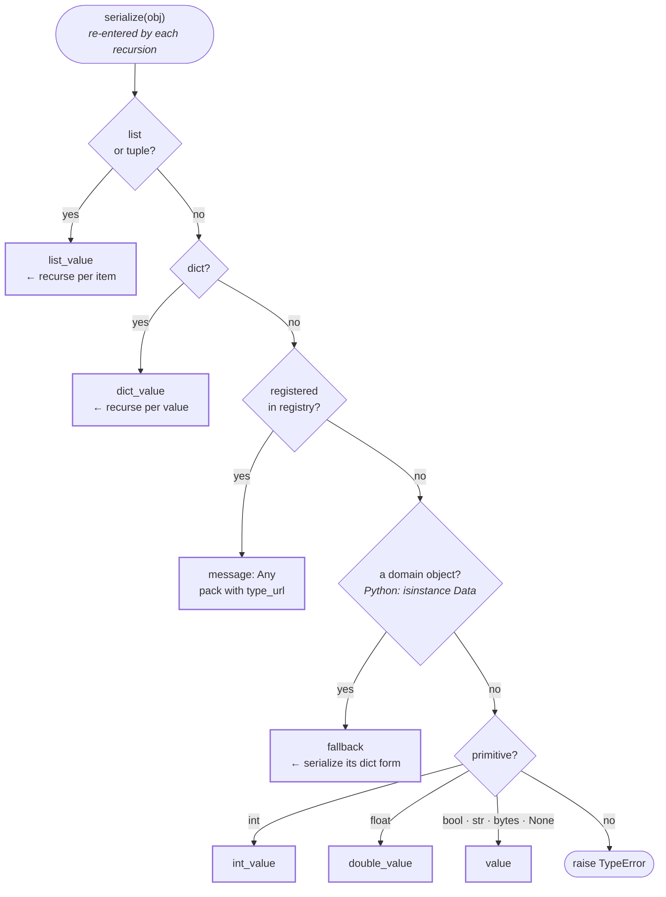
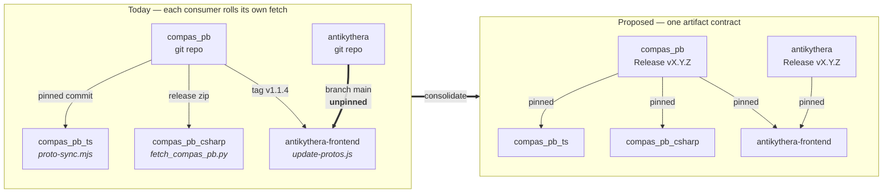

# Architecture

`compas_pb` is the Python reference implementation of a cross-language serialization
architecture. This page documents that architecture so sibling implementations
(`compas_pb_ts` for TypeScript, `compas_pb_csharp` for C#) and packages that own their own
domain models can follow the same contract.

The goal is a single wire format that carries **domain model objects** — not just the
generated `*Data` protobuf messages — between Python, TypeScript, C# and any other language
that gains a runtime. A `Frame` sent from Grasshopper arrives in a browser agent as a
`Frame`, and an Antikythera `TaskAssignmentMessage` arrives in Python as a
`TaskAssignmentMessage`, without either side knowing anything about the other's language.

## Two kinds of package

Every package in this architecture is one of two things. Keeping the distinction sharp is
what makes the system extensible.

| | Domain model owner | Language runtime |
| --- | --- | --- |
| **Examples** | `compas_pb`[^1], `antikythera`, `compas_timber` | `compas_pb`, `compas_pb_ts`, `compas_pb_csharp` |
| **Owns** | `.proto` files and the domain classes they mirror | registry, discovery, recursive codec |
| **Publishes** | proto bundle + generated bindings, every release | a serialization library for one language |
| **Knows about** | its own types only | no domain types at all |

[^1]:
    `compas_pb` is both, exceptionally. It owns the `.proto` files for COMPAS core types
    (`Point`, `Frame`, `Mesh`, `Graph`, …) because protobuf support has not been upstreamed
    into `compas` core yet. For every practical purpose, treat `compas_pb`'s ownership of
    those schemas as if it were core's own.

A language runtime never imports a domain package, and a domain package never implements
codec logic. They meet at the registry.

## How one domain model reaches many languages

The same three-part structure repeats in every language a domain owner supports: generated
bindings, domain classes that mirror the owner's own model, and a conversions module that
registers the mapping between them. Only the registration mechanism differs.

/// caption
One domain model, two languages. Solid borders exist today; dashed borders are proposed.
The proto bundle is what keeps the two columns describing the same wire — without a
published artifact, each language's bindings drift independently.
///

The registration arrow is the whole point of the design: `compas_pb` contains no reference
to Antikythera, and Antikythera contains no codec logic, yet
`pb_dump_bts(TaskAssignmentMessage(...))` works.

## The wire format

Every message is a `MessageData` envelope carrying a version tag and exactly one `AnyData`.
`AnyData` is a `oneof`, so a value occupies exactly one arm. Which arm it occupies decides
what the reader gets back.

/// caption
The seven arms of `AnyData`. `dict_value` and `list_value` recurse back into `AnyData`,
which is what makes arbitrary nesting work. The thick path is the one that surprises
people: `fallback` is the **only** arm whose decode runs `DataDecoder` and reconstructs a
COMPAS object. An envelope-shaped dict sent as `dict_value` arrives as a bare dict.
///

Two consequences worth stating explicitly, because implementations get them wrong:

- **`int_value` and `double_value` exist so numbers survive a round trip.** A
  `google.protobuf.Value` coerces everything to double, so `3` returns as `3.0`. An integer
  must use `int_value`; an integral float must use `double_value`.
- **`bytes` travel as a string** prefixed `base64:` inside `value`, since
  `google.protobuf.Value` has no bytes kind.

## Recursive dispatch

A runtime's encoder is one recursive function. It is worth reading as a decision tree,
because every arm above corresponds to exactly one branch.

/// caption
`compas_pb.core._serializer_any` as a decision tree. Registry lookup sits *between* the
container arms and the fallback arm — a registered type gets its native protobuf message,
and only an unregistered domain object degrades to `fallback`. The three container arms
re-enter at the top, once per item.

Decoding is the mirror image, dispatching on which `oneof` arm is set.
///

The registry lookup in the middle is where plugins take effect. In Python the lookup walks
the type's MRO, so registering a serializer for a base class covers its subclasses.

## Distributing schemas

A domain model owner publishes its `.proto` bundle and generated bindings as release
artifacts. Consumers pin a version and download it. This replaces the pattern that grew up
by default, where every consumer wrote its own script to scrape `.proto` files out of a git
repository.

/// caption
Three consumers, three hand-written fetchers, three different pinning strategies — one of
which pins nothing at all. Consolidating on published artifacts makes the schema version an
explicit, auditable dependency.
///

Rules for the artifact set:

- **Publish the `.proto` bundle.** It is what every downstream generator needs, and it is
  the one artifact that lets a language without an official binding get started.
- **Publish generated bindings per supported language.** Priority languages are TypeScript,
  C# and C++.
- **Skip a Python bindings artifact.** The generated `_pb2` modules already ship inside the
  wheel, so a separate archive would duplicate what `pip` delivers.
- **Pin by version, never by branch.** A consumer tracking a branch silently adopts wire
  changes at build time.

## The contract for a language runtime

To call itself a `compas_pb` runtime, a library must provide three things.

1. **A unified entry point.** `pb_dump_bts` / `pb_load_bts` in Python, adapted to local
   naming conventions elsewhere (`pbDump` / `pbLoad`). Callers pass a domain object and get
   bytes, or pass bytes and get a domain object. They never branch on type.
2. **Recursive resolution.** Encoding and decoding must recurse through `dict_value` and
   `list_value` so arbitrarily nested structures work, and must handle every arm of
   `AnyData` — including writing `fallback`, not only reading it.
3. **A registration mechanism.** Third-party packages must be able to add types without
   modifying the runtime. Automatic discovery is preferred where the language supports it;
   explicit registration is acceptable where it does not.

On the third point, languages differ in what they can honestly offer. Python enumerates
installed plugins through package metadata, so discovery is genuinely automatic and lazy.
JavaScript has no equivalent registry, and a bundled browser application cannot inspect its
own dependency tree at runtime — so TypeScript uses an explicit `register()` call. Keeping
the registration API separate from the discovery mechanism means a future build-time
discovery step can be added without changing how plugins declare themselves.

## Status

| Capability | Python | TypeScript | C# |
| --- | --- | --- | --- |
| Decode, recursive | yes | yes | yes |
| Encode, recursive | yes | **missing** | yes |
| Writes `fallback` | yes | **missing** | yes |
| Extensible registry | yes | **hardcoded map** | partial |
| Third-party registration | yes | **missing** | no |
| Automatic discovery | yes | not possible | no |

`compas_pb_ts` can encode a single registered wrapper into an envelope via `pbDumpBytes`,
and every wrapper class can serialize itself to its own `*Data` bytes. What it lacks is the
recursive layer above them — the equivalent of `_serializer_any` — so it cannot yet encode a
dict, a list, a nested structure, or a `fallback`.
