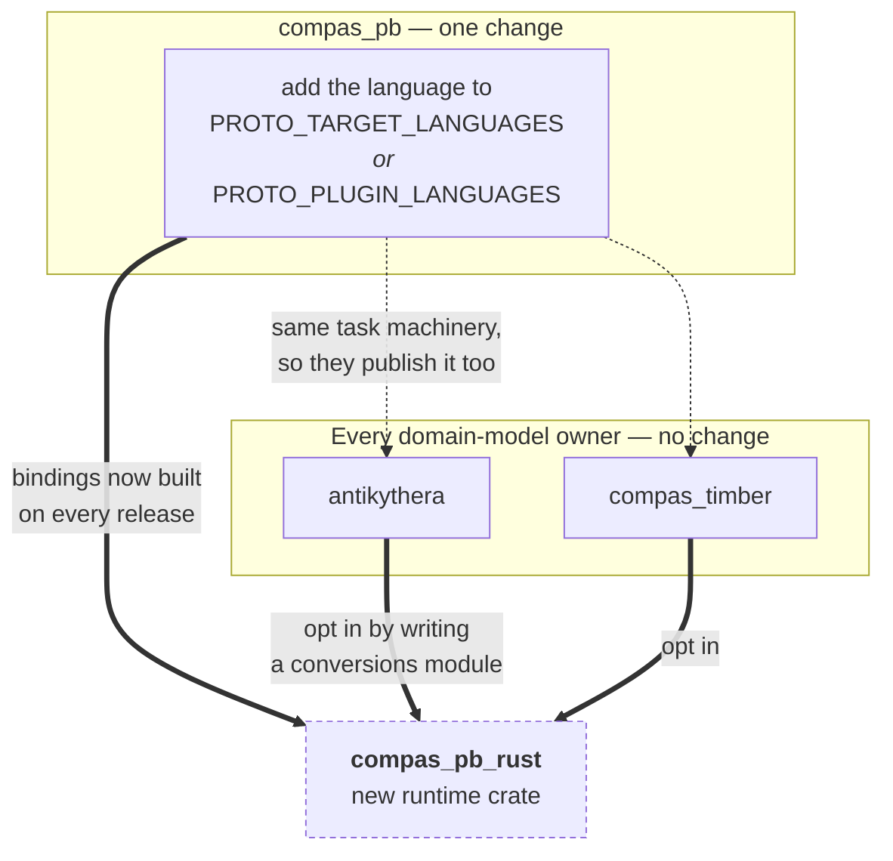

# Implementing a runtime for a new language

COMPAS models are authored in Python, but less and less of what consumes them is: a browser
agent driving a session, a Rhino plugin in C#, a controller in Rust. `compas_pb` is what
lets those exchange the same objects rather than a hand-rolled JSON dialect per pairing — a
`Frame` sent from Grasshopper arrives in a browser as a `Frame`. This page is what it takes
to add a language to that set.

Read [Architecture](architecture.md) first for who owns what. In short: a **language
runtime** implements the registry and codec for one language and knows nothing about any
domain model; **domain-model owners** own `.proto` files and register their types into the
runtimes they support.

## The contract

1. **A unified entry point** — `pb_dump_bts` / `pb_load_bts`, adapted to local naming.
   Callers pass a domain object and get bytes, or the reverse. They never branch on type.
2. **Recursive resolution** — recurse through `dict_value` and `list_value`, and handle
   every arm of `AnyData`, including *writing* `fallback`.
3. **A registration mechanism** — third parties add types without modifying the runtime.

## The wire format

Every message is a `MessageData`: a version string and one `AnyData`. Check the version
before trusting the payload, using a compatibility key rather than equality. Under `0.x`
the key is `MAJOR.MINOR`; from `1.0` on it is `MAJOR`. So `1.0.0` reads `1.2.9`, and
`0.5.1` reads `0.5.7` but not `0.6.0`. Mirror `compas_pb.core._wire_compat_key`. A missing
version tag is an error, not a default.

`AnyData` is a `oneof`. Dispatch on which arm is set; never probe fields for presence.

| Arm | Carries | Notes |
| --- | --- | --- |
| `message` | `google.protobuf.Any` | A registered type; also the legacy home of containers |
| `value` | `google.protobuf.Value` | null, bool, string — and bytes, see below |
| `fallback` | `FallbackData` | The only arm that reconstructs an object |
| `int_value` | `int64` | |
| `double_value` | `double` | |
| `dict_value` | `DictData` | Recurses |
| `list_value` | `ListData` | Recurses |

## Five things that fail quietly

Each of these produced a real bug while `compas_pb_ts` was being built. None of them throw.

**Integers becoming floats.** `google.protobuf.Value` coerces every number to double, which
is why the explicit arms exist. An integer goes in `int_value`; a float goes in
`double_value` *even when integral*. A language with distinct numeric types must keep them
distinct. A language without one (JavaScript) cannot fully honour this — say so, and pick a
consistent rule.

**Bytes as a tagged string.** `Value` has no bytes kind, so bytes are base64-encoded into
`string_value` behind a `base64:` prefix, and decoded back on the way in. Skip it and
callers get the literal string `"base64:AAEC/w=="`.

**`fallback` is the only arm that reconstructs.** `dict_value` decodes to a plain
dictionary; the decoder never inspects it for a `{dtype, data}` envelope. A domain object
with no registered serializer must go out as `fallback` or it arrives as a bare dict.
Python reaches this arm from a live `Data` instance; TypeScript, which never holds one,
uses the `{dtype, data}` shape instead. Decide what "this is a domain object" means in your
language and put the check at the same point — after the registry lookup, before the
plain-dictionary arm.

**Legacy containers.** Before the native container arms existed, containers were packed
into `message` as `Any`-wrapped `ListData` and `DictData`. Stored data still contains them,
so decode both; encode only the native arms.

**Short type-URL matching.** Types are packed as
`type.googleapis.com/<fully.qualified.name>`. Match everything after the final `/`, not the
last dot-separated segment. Short names work until two packages register the same class
name.

## Registration and discovery

Keep them separate: discovery is the part that varies by language, and separating them lets
you add it later without changing how plugins declare types.

Store **functions**, not a required class shape — Python keys a serializer by type and a
deserializer by protobuf name, which keeps domain models free of protobuf concerns. A
registry demanding "expose a `bytes` property" forces every plugin to wrap its own model.
Lookup should follow the language's inheritance chain so a base registration covers
subclasses.

For discovery, offer what your language can honestly deliver: Python enumerates packaging
entry points; Rust can register at link time (`inventory`, `linkme`); C# can scan loaded
assemblies. TypeScript gets an explicit `register()` call, because a bundler can silently
drop both a side-effect import and generated registration code — worse than a call you can
see.

## Schemas: consume, never vendor

Schema owners publish the `.proto` bundle and per-language bindings on every release. Pin a
version and download the artifact. Three consumers each wrote their own git-scraping
fetcher before this rule existed, and one tracked a branch, so its build silently adopted
wire changes.

**Shared types must resolve to the runtime package's copy.** A domain owner's `.proto`
imports `compas_pb`'s, so its generated code refers to `compas_pb.data` types. In
TypeScript this is load-bearing — protobuf-es links descriptors by identity, so a vendored
second copy registers a competitor and the two halves disagree about types they share. Two
Rust crates each generating `compas_pb.data` likewise produce non-interchangeable types.
Depend on the runtime package for them.

## What changes elsewhere

/// caption
Adding a language touches one place. Domain-model owners reuse compas_pb's task machinery,
so they publish bindings for the new language without any change of their own — but a
domain model only *reaches* it once someone writes its conversions module.
///

In **`compas_pb`**, add the language to the generation task: `PROTO_TARGET_LANGUAGES` if
`protoc` emits it natively, otherwise `PROTO_PLUGIN_LANGUAGES` with its plugin's flag
prefix, caching the binary as `setup_protoc_gen_es` does. Rust needs `protoc-gen-prost`;
plugin-backed languages are pinned by *plugin* version in the asset name, since the plugin
shapes the generated API.

In **domain-model owners**, nothing changes for bindings to appear. Reaching the new
language does need someone to write the conversions module — the counterpart of
`antikythera.models.conversions`.

In **other runtimes**, nothing. They share a wire format, not code.

## Proving conformance

Test against bytes, not your own round trips — a round trip passes when both directions are
wrong in the same way.

- Decode a payload produced by Python's `pb_dump_bts`, committed as a base64 constant.
  `compas_pb_ts` does this with a real task message; it is the most useful test there.
- Have Python decode a payload produced by you. Catches encoding bugs a self-round-trip
  hides.
- Cover each arm, including the five above, and a third-party registration.

## Checklist

- [ ] Version tag written and checked with the compatibility key
- [ ] All seven arms encoded and decoded, dispatching on the set arm
- [ ] Integers and floats kept distinct, or the limitation documented
- [ ] Bytes through the `base64:` convention
- [ ] `fallback` written, not only read
- [ ] Legacy `Any`-wrapped containers still decode
- [ ] Type URLs matched on the full name after the final `/`
- [ ] Registry stores functions and accepts third-party registration
- [ ] Unified entry point, no type branching by callers
- [ ] Bindings consumed from a pinned release artifact, never vendored
- [ ] Shared `compas_pb` types resolve to the runtime package's copy
- [ ] Conformance tested in both directions against Python bytes
