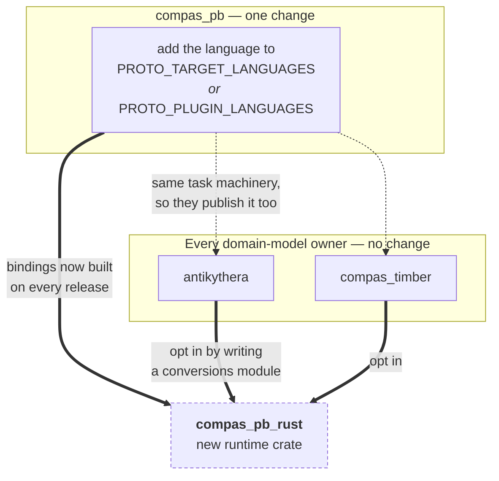

# Implementing a runtime for a new language

COMPAS models are written in Python, but more and more of what uses them is not: a browser
agent running a session, a Rhino plugin in C#, a controller in Rust. `compas_pb` is what
lets all of those pass the same objects around, instead of inventing a JSON format for
every new pair of tools. A `Frame` sent from Grasshopper shows up in the browser as a
`Frame`. This page explains how to add a language to that set.

Have a look at [Architecture](architecture.md) first, for who owns what. The short version:
a **language runtime** implements the registry and the codec for one language, and knows
nothing about any domain model. **Domain-model owners** own `.proto` files and register
their types with the runtimes they care about.

## What your runtime has to do

1. **One entry point in, one out.** `pb_dump_bts` and `pb_load_bts`, named to suit your
   language. People hand you an object and get bytes, or hand you bytes and get an object.
   They should never have to check the type themselves.
2. **Handle nesting.** Walk into `dict_value` and `list_value`, and support every arm of
   `AnyData` — including *writing* `fallback`, not just reading it.
3. **Let other packages register types**, without them having to edit your code.

## The wire format

A message is a `MessageData`: a version string plus one `AnyData`.

Check the version before you trust anything else. Don't compare the versions directly —
compare their compatibility keys. Under `0.x` the key is `MAJOR.MINOR`, and from `1.0`
onwards it is just `MAJOR`. So `1.0.0` can read `1.2.9`, and `0.5.1` can read `0.5.7` but
not `0.6.0`. `_wire_compat_key` in `compas_pb.core` has the logic to copy. If there is no
version at all, that is an error — don't assume one.

`AnyData` is a `oneof`, so exactly one of these is set. Look at which one it is and switch
on that, rather than testing each field to see if it has a value.

| Arm | Holds | Worth knowing |
| --- | --- | --- |
| `message` | `google.protobuf.Any` | A registered type. Older data also puts lists and dicts here |
| `value` | `google.protobuf.Value` | null, bool and string. Bytes live here too, base64-encoded behind a `base64:` prefix |
| `fallback` | `FallbackData` | The only arm that rebuilds a real object rather than a dict |
| `int_value` | `int64` | Whole numbers |
| `double_value` | `double` | Floats, even when the value is round, like `3.0` |
| `dict_value` | `DictData` | Nests |
| `list_value` | `ListData` | Nests |

Four rules that are easy to miss:

- If your language has separate integer and float types, keep them apart. If it does not
  (JavaScript), you cannot fully honour this — pick a rule and write it down.
- Decode lists and dicts in both shapes, old and new, but only ever encode the new ones.
- Match type URLs on everything after the last `/`, not on the last piece after a dot.
  Short names seem fine until two packages both register a class called `TaskError`.
- An object with no registered serializer has to go out as `fallback`, or it arrives as a
  plain dict. Python knows it has an object because it holds a live `Data` instance;
  TypeScript never does, so it looks for the `{dtype, data}` shape instead. Decide what
  that question means in your language, and ask it in the same place: after the registry
  lookup, before "this is just a dictionary".

## Registering types, and finding them

These are two separate jobs. Registering is a package saying "this class maps to that
protobuf message". Discovery is your runtime finding those declarations on its own. Split
them, and you can add discovery later without changing how packages declare things.

Store **functions**, not a required class shape. Python keeps a serializer per type and a
deserializer per protobuf name, which means a domain model never has to know protobuf
exists. If your registry instead insists that every registered class has, say, a `bytes`
property, then every package has to wrap its own model just to register it. When you look a
type up on the way out, follow your language's inheritance chain, so registering a base
class also covers everything below it.

For discovery, do whatever your language can actually support. Python lists installed
plugins through packaging entry points. Rust can register at link time with `inventory` or
`linkme`. C# can scan the assemblies it has loaded. TypeScript gets a plain
`register()` call you make yourself, because a bundler can quietly drop a side-effect
import — and a call you can see beats one that vanishes.

## Getting the schemas

Don't copy `.proto` files into your repo, and don't generate them yourself. Whoever owns a
schema publishes the `.proto` bundle and the generated bindings for each language on every
release. Pin a version, download the artifact, done. Pulling files straight out of git
works right up until you follow a branch and your build quietly picks up a wire change.

**Shared types have to come from the runtime package.** A domain owner's `.proto` imports
`compas_pb`'s, so its generated code refers to `compas_pb.data` types. Those need to be the
same types your runtime uses. In TypeScript this really matters: protobuf-es matches file
descriptors by identity, so a second copy registers a rival definition and the two halves
stop agreeing about types they are meant to share. Two Rust crates that each generate
`compas_pb.data` end up with two types that will not talk to each other. Depend on the
runtime package for them.

## What changes everywhere else

/// caption
Adding a language touches one place. Domain-model owners share compas_pb's build tasks, so
they start publishing bindings for the new language on their own — but a domain model only
*reaches* that language once someone writes its conversions module.
///

In **`compas_pb`**, add your language to the generation task. If `protoc` can emit it
directly, add it to `PROTO_TARGET_LANGUAGES`. If it needs a plugin, add it to
`PROTO_PLUGIN_LANGUAGES` with the flag its plugin uses, and cache the binary the way
`setup_protoc_gen_es` does. Rust needs `protoc-gen-prost`. Languages that need a plugin are
tagged with the *plugin* version in the asset name, since the plugin is what decides how
the generated code looks.

In **domain-model owners**, nothing has to change for the bindings to start appearing. For
a domain model to actually reach your language, someone has to write the conversions module
— the equivalent of `antikythera.models.conversions`.

In **other runtimes**, nothing at all. They share a wire format, not code.

## Testing it

Test against real bytes, not just your own round trips. A round trip still passes if you
get both directions wrong in the same way.

- Take a payload from Python's `pb_dump_bts`, commit it as a base64 string, and check you
  decode it correctly. This is the single most useful test you can write.
- Then go the other way: have Python read something you wrote.
- Cover every arm, plus a type registered by a package other than your own.

## Checklist

- [ ] Version written, and checked with the compatibility key
- [ ] All seven arms read and written, switching on the one that is set
- [ ] Whole numbers and floats stay apart, or the limitation is written down
- [ ] Bytes go through the `base64:` prefix
- [ ] `fallback` is written, not only read
- [ ] Old `Any`-wrapped lists and dicts still decode
- [ ] Type URLs matched on the full name after the last `/`
- [ ] Registry holds functions, and other packages can register types
- [ ] One entry point each way, with no type checking left to callers
- [ ] Bindings come from a pinned release, not copied into the repo
- [ ] Shared `compas_pb` types come from the runtime package
- [ ] Tested both directions against bytes Python produced
