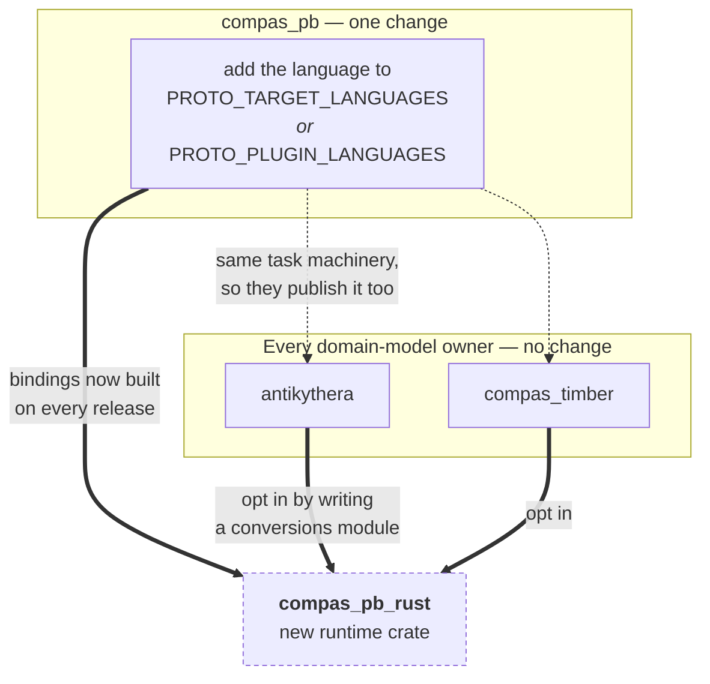

# Implementing a runtime for a new language

This page is for anyone building `compas_pb` support for a language that does not have it
yet — `compas_pb_rust`, `compas_pb_go`, and so on. It describes what the new package has to
do to interoperate, what has to change elsewhere, and which parts of the wire format are
easy to get subtly wrong.

Read [Architecture](architecture.md) first for who owns what. In short: a **language
runtime** implements the registry and the codec for one language and knows nothing about
any domain model, while **domain-model owners** own `.proto` files and register their types
into whichever runtimes they support.

## The contract

A runtime must provide three things.

1. **A unified entry point.** `pb_dump_bts` / `pb_load_bts` in Python, adapted to local
   naming (`pbDump` / `pbLoad`, `pb_dump` / `pb_load`). A caller passes a domain object and
   gets bytes, or passes bytes and gets a domain object back. Callers never branch on type.
2. **Recursive resolution.** Encoding and decoding recurse through `dict_value` and
   `list_value`, and handle every arm of `AnyData` — including *writing* `fallback`, not
   only reading it.
3. **A registration mechanism.** Third-party packages must be able to add types without
   modifying the runtime. Automatic discovery where the language supports it, explicit
   registration where it does not.

Everything below is detail in service of those three.

## The wire format, in the order you will implement it

### The envelope

Every message is a `MessageData` carrying a version string and one `AnyData`. Check the
version before trusting the payload, and reject rather than guess:

```
key(version) != key(own version)  ->  refuse to decode
```

The comparison uses a *wire-compatibility key*, not equality. Under `0.x` every minor
release may change the binary schema, so the key is `MAJOR.MINOR`; from `1.0` on, minor
releases stay compatible and the key is `MAJOR`. So `1.0.0` reads `1.2.9`, and `0.5.1`
reads `0.5.7` but not `0.6.0`. Mirror `compas_pb.core._wire_compat_key` exactly.

A missing version tag is an error, not a default.

### The seven arms

`AnyData` is a `oneof`. Dispatch on which arm is set — never probe fields for
presence. Languages that model a `oneof` as a tagged union (Rust enums, protobuf-es
discriminated unions) get this for free; languages that model it as optional sibling fields
make it easy to write a check that silently reads the wrong arm.

| Arm | Carries | Notes |
| --- | --- | --- |
| `message` | `google.protobuf.Any` | A registered type. Also the legacy home of containers. |
| `value` | `google.protobuf.Value` | null, bool, string — and bytes, see below |
| `fallback` | `FallbackData` | The only arm that reconstructs an object |
| `int_value` | `int64` | |
| `double_value` | `double` | |
| `dict_value` | `DictData` | Recurses |
| `list_value` | `ListData` | Recurses |

### The four traps

These are the places a new implementation tends to go wrong. Each one produced a real bug
while `compas_pb_ts` was being built.

**Integers must not become floats.** `google.protobuf.Value` coerces every number to
double, which is why `int_value` and `double_value` exist. An integer goes in `int_value`;
a float goes in `double_value` *even when it is integral*, so a Python `3.0` comes back a
float rather than an int.

This is the one rule a language cannot always honour. If your language has a single numeric
type that cannot distinguish `3` from `3.0` (JavaScript), say so in your documentation and
pick a consistent rule — `compas_pb_ts` sends an exact integer as `int_value`, so a Python
float that happens to be integral does not survive a round trip through the browser. A
language with distinct integer and float types (Rust, Go, C#) has no such problem and must
keep them distinct.

**Bytes travel as a tagged string.** `google.protobuf.Value` has no bytes kind, so bytes
are base64-encoded into `string_value` with a `base64:` prefix. On decode, a string with
that prefix becomes bytes again. A runtime that skips this returns the literal string
`"base64:AAEC/w=="` to its callers.

**`fallback` is the only arm that reconstructs.** `dict_value` decodes to a plain
dictionary — the decoder does *not* inspect it for a `{dtype, data}` envelope. Only
`fallback` runs the COMPAS decoder and rebuilds the object. So a runtime that sends a
domain object it has no registered serializer for must use `fallback`, or that object
arrives everywhere else as a bare dictionary.

Python reaches this arm from a live `compas.data.Data` instance. A language with no COMPAS
class hierarchy has to answer the same question differently: `compas_pb_ts` treats a plain
object shaped `{dtype, data}` as the equivalent signal, because in a browser that is the
only form a COMPAS object ever takes. Decide what "this is a domain object" means in your
language, and put the check at the same point in the dispatch — after the registry lookup,
before the plain-dictionary arm.

**Legacy containers still arrive.** Before the native `dict_value` and `list_value` arms
existed, containers were packed into `message` as `Any`-wrapped `ListData` and `DictData`.
Stored data still contains them, so decoding must handle both. Encoding should only ever
produce the native arms.

### Type URLs

A registered type is packed into `Any` with `type.googleapis.com/<fully.qualified.name>`.
Match on **everything after the final `/`**, as `type_url.rpartition("/")[2]` does — not on
the last dot-separated segment. Short-name matching appears to work while only `compas_pb`
types are registered, because those names are unique; it breaks the moment a domain-model
owner registers `antikythera.v1.TaskError` alongside some other `TaskError`.

## Registration and discovery

Registration is the mechanism a package uses to declare "this class maps to that protobuf
message". Discovery is how the runtime finds those declarations without being told. Keep
them separate: discovery is the part that varies by language, and separating them lets you
add discovery later without changing how plugins declare their types.

Store *functions*, not a required class shape. Python's registry holds a serializer keyed
by type and a deserializer keyed by protobuf name, which lets a domain model stay free of
protobuf concerns. A registry that instead demands "your class must expose a `bytes`
property" forces every plugin to wrap its own model.

Lookup on the way out should follow the language's inheritance chain, so registering a base
class covers its subclasses — Python walks the MRO; `compas_pb_ts` walks the prototype
chain; Rust, with no inheritance, needs no such walk.

For discovery, offer what your language can honestly deliver:

- **Python** enumerates installed plugins through packaging entry points, so discovery is
  automatic and lazy.
- **TypeScript** has no equivalent, and a bundled browser application cannot inspect its
  dependency tree at runtime, so registration is an explicit `registerAntikytheraTypes()`
  call. Both alternatives — a side-effect import, or build-time codegen — can be silently
  dropped by a bundler, which is worse than an explicit call.
- **Rust** can register at link time with a distributed-slice crate (`inventory`,
  `linkme`), which is the closest thing to Python's behaviour: a dependent crate declares
  its types and the runtime finds them with no call in `main`.
- **C#** can scan loaded assemblies for an attribute, with the usual caveat that an
  assembly is not loaded until something touches it.

Whatever you choose, document how a plugin author declares types and when they take effect.

## Consuming the schemas

**Do not vendor `.proto` files, and do not generate them yourself.** The package that owns
a schema publishes, on every release, the `.proto` bundle and generated bindings for each
supported language. Pin a version and download the artifact. Three separate consumers each
wrote their own git-scraping fetcher before this rule existed, and one of them tracked a
branch rather than a tag, so its build silently adopted wire changes.

**Shared schemas must come from the runtime package, not a second copy.** A domain-model
owner's `.proto` files import `compas_pb`'s, so its generated code refers to
`compas_pb.data` types. Those must resolve to the *same* definitions the runtime uses. In
TypeScript this is load-bearing: protobuf-es links file descriptors by identity, so a
vendored second copy registers a competing descriptor for the same message and the two
halves disagree about types they are supposed to share. `compas_pb_ts` therefore exposes
its generated modules as subpath exports, and `antikythera_ts` rewrites its generated
imports to point at them.

Check the equivalent in your language before assuming it does not apply: in Rust, two
crates each generating `compas_pb.data` produce two distinct, non-interchangeable types.
The fix is the same — depend on the runtime crate for the shared types.

## What has to change elsewhere



/// caption
Adding a language touches one place. Domain-model owners reuse compas_pb's task machinery,
so they start publishing bindings for the new language without any change of their own —
but a domain model only *reaches* the new language once someone writes its conversions
module.
///

**In `compas_pb`**, add the language to the generation task. If `protoc` emits it natively,
append it to `PROTO_TARGET_LANGUAGES` and you are done. If it needs a plugin — as Rust and
TypeScript both do — add it to `PROTO_PLUGIN_LANGUAGES` with the flag prefix its plugin
registers, and cache the plugin binary the way `setup_protoc_gen_es` does. Plugin-backed
languages are pinned by *plugin* version in the asset name, since the plugin is what shapes
the generated API.

For Rust that means `protoc-gen-prost`, since `protoc` has no native Rust output.

**In domain-model owners**, nothing has to change for the bindings to appear: they reuse
the same task machinery, so a language added in `compas_pb` is published by every owner on
its next release. Reaching the new language does require someone to write the conversions
module — the counterpart of `antikythera.models.conversions` — mapping that owner's domain
classes to their protobuf messages.

**Nothing changes in the other runtimes.** They share a wire format, not code.

## Proving conformance

The wire format is the contract, so test against bytes rather than against your own
round trips. A round-trip test passes even when both directions are wrong in the same way.

- **Decode a payload produced by Python.** Generate one with `pb_dump_bts`, commit it as a
  base64 constant, and assert your runtime decodes it to the expected values.
  `compas_pb_ts` does this with a real Antikythera task message, and it is the single most
  useful test in that repository.
- **Have Python decode a payload produced by you.** The other direction catches encoding
  bugs that a self-round-trip hides — an integral float sent as `int_value`, an envelope
  sent as `dict_value` instead of `fallback`.
- **Cover each arm explicitly**, including the traps above: an integer and a float that
  stay distinct, bytes through `base64:`, a `{dtype, data}` envelope landing in `fallback`,
  a nested dict inside a list, a legacy `Any`-wrapped container decoding correctly, and an
  empty `AnyData` resolving to null rather than throwing.
- **Cover a third-party registration**, so the plugin path is exercised by something other
  than the built-in types.

## Checklist

- [ ] Envelope written with a version tag; version checked on read using the compatibility key
- [ ] All seven `AnyData` arms encoded and decoded, dispatching on the set arm
- [ ] Integers and floats kept distinct; documented if your language cannot
- [ ] Bytes through the `base64:` convention
- [ ] `fallback` written, not only read
- [ ] Legacy `Any`-wrapped `ListData` and `DictData` still decode
- [ ] Type URLs matched on the full name after the final `/`
- [ ] Registry stores functions and supports third-party registration
- [ ] Unified entry point that callers use without branching on type
- [ ] Generated code consumed from a pinned release artifact, never vendored
- [ ] Shared `compas_pb` types resolve to the runtime package's copy
- [ ] Conformance tests in both directions against Python-produced bytes
